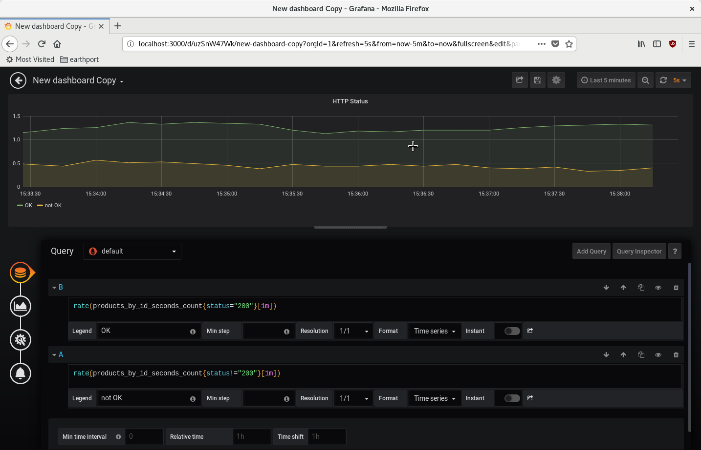

# Spring Boot Java Microservice

Java REST API microservice for tests and demos.

## Run with Docker

First image build may take minutes.
```bash
docker build -t springboot-app:1.0.0 .
docker run --rm -p 8080:8080 springboot-app:1.0.0
```
Then, you can GET the following URLs in the browser or `curl`:
```
http://localhost:8080/products
http://localhost:8080/products/10
http://localhost:8080/actuator/health
http://localhost:8080/actuator/prometheus
```

#### Prometheus and Grafana with Docker

To make containers visible to each other, they should run in the same Docker network.
```bash
docker network create my-network
docker network ls

docker build -t springboot-app:1.0.0 .

# Run the app in the created network and with explicit container name
docker run --rm --network=my-network --name=springboot-app -p 8080:8080 springboot-app:1.0.0
```

Containers' names will be resolved based on the specified name argument of `docker run` command. In the case above,
the application container will be referenced as `springboot-app`.

NOTE: In the run command above, the container output will be attached to the terminal and it will be stopped 
with `ctrl+C`. Optionally, you can add a `-d` to the run command to make it run in the background and manage the
containers with `docker` commands:

```
docker run -d ...
docker ps
docker logs <CONTAINER_NAME>
docker stop <CONTAINER_NAME>
```

At this point, you can try the app APIs at `http://localhost:8080/products` or
`http://localhost:8080/products/10`. Also you can generate a few `404`s trying
to hit `http://localhost:8080/products/666`.

There is a `prometheus.yml` config file that Prometheus should load in order to know where to scrap for metrics,
in this case, how to find and query the application exposing a metrics endpoint.

```bash
docker run --rm --name=prometheus --network=my-network -p 9090:9090 \
    -v "$(pwd)/prometheus.yml:/etc/prometheus/prometheus.yml" \
    prom/prometheus --config.file=/etc/prometheus/prometheus.yml

docker run --rm --name=grafana --network=my-network -p 3000:3000 grafana/grafana
```

Prometheus UI can be accessed from the browser at http://localhost:9090. You can try to execute queries,
like `process_cpu_usage`, then select "graph" to see it plotted.

Grafana is a more popular and feature-rich metrics dashboard, and can be accessed in the browser at
http://localhost:3000. The default login/password is `admin`. You can add a Prometheus data source and create
dashboards.

In the home screen, go to "create your first data source". After selecting Prometheus, you just need to set
the HTTP URL where the service is running. Having in mind containers in the same network are being resolved by name,
set `http://prometheus:9090` as data source URL, then save.

Now you can create your first dashboard. Back to the home scree, You can select "New dashboard" button or go to the
plus icon at the left. A new Panel is created in the fresh dashboard. You can "Add Query", type `process_cpu_usage`,
un-select the field (click somewhere else) and a graph should be plotted above. You can "save dashboard" in the
floppy disk button at the top to go back to the dashboard.

### Generating traffic to try Prometheus queries

With the service up and running, you can open a new terminal tab and keep run:
```
./generate_requests.sh
```

It will randomly hit the API with valid (200) and invalid (404) results. After a few minutes, try to see the results
in Grafana creating a dashboard to count Status codes per minutes.

Try to add a Panel, adding the 2 following metrics to the same Panel:
* `rate(products_by_id_seconds_count{status="200"}[1m])` to see the rate of
  200 per minute.
* `rate(products_by_id_seconds_count{status!="200"}[1m])` to see the rate of
  not-200 per minute.

